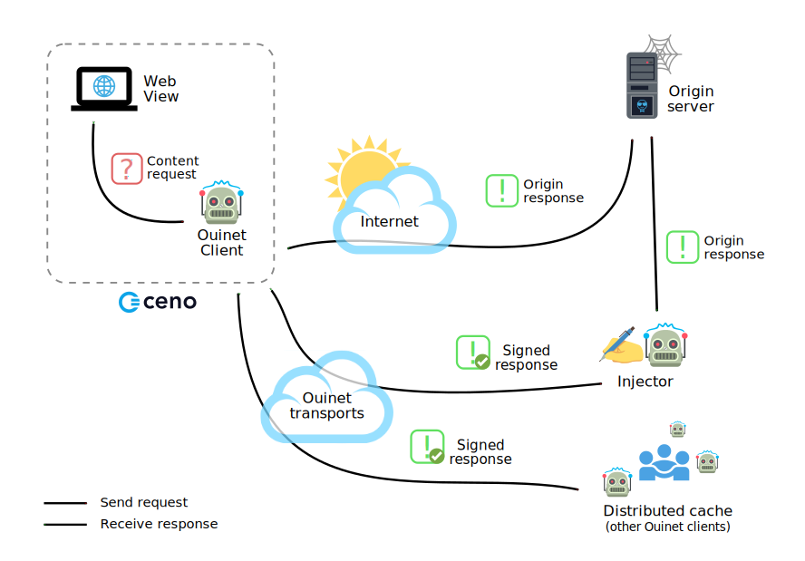

[](https://gitlab.com/equalitie/ouinet/commits/main)
[](https://gitlab.com/equalitie/ouinet/-/releases)
[](./LICENSE)

Ouinet is a collection of open source software libraries that create a
decentralized network of cooperating peers for sharing and propagating web
content. A Ouinet deployment requires supporting infrastructure - run by a
trusted network operator - and the integration of its client libraries into
third-party applications for requesting and receiving desired content.
Ouinet clients collectively form a distributed cache that is global in nature,
but also functional on a local or national network. Peer-to-peer transports
are used for communications.

Ouinet's primary integration and its initial _raison d'etre_ is to power the
[Ceno Browser](https://censorship.no) - utilized for accessing web content
behind national firewalls. Supporting infrastructure on this project is
provided by [eQualitie](https://equalit.ie), offering injection and
authentication of web content into a decentralized p2p network, using the
BitTorrent DHT for addressing and routing. Coupled with sneakernet technology
operated by eQualitie, Ceno users can access
[cached website replicas](https://schedule.ceno.life), from heavily limited
or entirely isolated network environments.


## How it works?

A typical [client][] node setup consists of a web browser or other application
using the special HTTP proxy provided by Ouinet. When the Ouinet proxy gets a
request for content, it attempts to retrieve the resource using several
mechanisms. For example, it could try to fetch a page from the [distributed cache][]
by looking up the content in the BitTorrent DHT and if the content is not
available, it could also contact a trusted [injector][] server over a
peer-to-peer routing system (like the [BitTorrent DHT][] or [I2P][]) and ask to
fetch the page and store it in the distributed cache.

See our [lightning talk at the Decentralized Web Summit 2018][] for an
overview of Ouinet's architecture or check the [documentation website][].

For a detailed technical explanation of processes and protocols you can refer
to [Ouinet's white paper][].

[lightning talk at the Decentralized Web Summit 2018]: http://archive.org/details/dweb-8_2_18_Lightning_Talks_New_Discoveries_5?start=547
[documentation website]: https://ouinet.work/docs/how/index.html
[Ouinet's white paper]: doc/ouinet-network-whitepaper.md
[BitTorrent DHT]: http://bittorrent.org/beps/bep_0005.html
[I2P]: https://geti2p.net/ "Invisible Internet Project"
[client]: https://ouinet.work/docs/how/client.html
[injector]: https://ouinet.work/docs/how/injectors.html
[distributed cache]: https://ouinet.work/docs/how/cache.html



**Warning:** Ouinet is **not an anonymity tool**, information about your
browsing can be seen by other participants in the network, as well as the
fact that your application is seeding particular content.


## Request mechanisms

These mechanisms to retrieve content are attempted as parallel coroutines
showing the results of the first responding method.

- *Origin*: The client contacts the origin server directly via HTTP(S).
- *Proxy*: The client contacts the origin server through an HTTPS proxy
  (any available injector) and retrieves the content without
  signing it.
- *Injector*: The client asks the injector to fetch and sign the content
  from the origin server, then it starts seeding the signed content to
  the distributed cache.
- *Distributed Cache*: The client attempts to retrieve the content from
  the distributed cache.


# Bridge nodes

When a client establishes a connection to an injector and verifies that the
connection is genuine, it may then choose to function as an intermediary,
allowing less fortunate clients to reach the injector through them. A client
functioning as an intermediary in this way is referred to as a bridge node.

If a client chooses to function as a bridge node, it will accept connections
using the [uTP protocol](http://www.bittorrent.org/beps/bep_0029.html), and
announce its address details to the BitTorrent distributed hash table. Whenever
the client accepts a connection in this way, it will create a connection to an
injector and forward all traffic received over the incoming connection to the
connection with the injector, and vice versa. This lets the client function as
an intermediary between an injector, and a different client that is unable to
connect to the injectors directly.

A detailed explanation of Bridges can be found in Ouinet's
[docs](https://ouinet.work/docs/how/injectors.html?highlight=peer#peer-to-peer-tunnels).


## Software Artifacts

* *Client*: Command line application that serves as a proxy to the Ouinet
network.
* *Injector*: Command line application that retrieves content from origin
websites and injects the signed content to the Ouinet network so it can be
shared peer-to-peer.
* *Android libraries*: Java Native Interface used to expose the C++ Ouinet
networking libraries to the Android applications written in Java or Kotlin.


## Building from source

The following instructions were tested in Debian 12 with the following
packages installed; `build-essential`, `cmake`, `git`, `libssl-dev` and
`zlib1g-dev`, but in general to build Ouinet natively on your GNU/Linux
system you just need *CMake 3.5+* and *g++* capable of C++14.

Ouinet uses Git submodules, thus to properly clone it, use:

```shell
$ git clone --recursive https://gitlab.com/equalitie/ouinet.git
```

Assuming that `<SOURCE DIR>` points to the directory where the
`CMakeLists.txt` file is, and `<BUILD DIR>` is a directory of your choice
where all (even temporary) build files will go, you can build Ouinet with:

```shell
$ mkdir -p <BUILD DIR>
$ cd <BUILD DIR>
$ cmake <SOURCE DIR>
$ cmake --build <BUILD DIR>
```

When the build process finishes you will find in `<BUILD DIR>` the binaries
for `client`, `injector` and their shared libraries, e.g. `libboost_asio.so`,
`libcpp_upnp.a`, etc.

Please refer to Ouinet docs for instructions to build artifacts using a
[Docker](https://ouinet.work/docs/build/docker.html) or
[Vagrant](https://ouinet.work/docs/build/vagrant.html) dev environments.


## Running the Injector

It's recommended to create a directory named `repos/injector` where the
configuration file, the ed25519 keys and the TLS certificates will be stored.

The minimum configuration to start the Injector is shown below:

```conf
# repos/injector/ouinet-injector.conf

listen-on-utp-tls = 0.0.0.0:7085
credentials = test_user_change_me:test_password_change_me
```

You could also find more details of the available options in this
[config example](repos/injector/ouinet-injector.conf) or invoking
`injector --help`.

When your `repo` dir and the configuration file are ready you can start
the injector as follows:

```shell
$ ./injector --repo /path/to/your/repo
```

During its first start the injector will generate the private and public keys
needed to [sign content](https://ouinet.work/docs/how/cache.html#signatures)
(`ed25519-*` files) and the certificates used to establish a TLS connection
when contacting the injector via uTP protocol. Please keep an eye on these
files as some of them will be needed to configure your Ouinet clients.

For a production environment you may want to deploy the Injector using
[Docker Compose](https://ouinet.work/docs/build/docker.html#docker-deployment).

**Warning:** Running an Injector turns the host into a web proxy for Clients
with the correct credentials, which could pose a security or privacy risk
depending on your context. Please keep this in mind and only assume
reasonable risks.

## Running a Client

Create a repo directory, e.g. `repos/client` and add the configuration file
for the new client:

```conf
# repos/client/ouinet-client.conf

cache-type = bep5-http
cache-http-public-key = abcdefghijklmnopqrstuvwxyz01234567890abcdefghijklmno
injector-tls-cert-file = /path/to/your/repo/client/tls-cert.pem
injector-credentials = test_user_change_me:test_password_change_me
```

The value of `cache-http-public-key` can be obtained from the injector file
named `ed25519-public-key` or from the injector log entry that starts with
`[INFO] Injector swarm: sha1('ed25519:abcdefghijklmnopqrstuvwxyz01234567890abcdefghijklmno/v6/injectors`.

`injector-tls-cert-file` is the path to the `tls-cert.pem` copied from the
injector and `injector-credentials` should be set to the same value defined
as `credentials` in `ouinet-injector.conf`.

When the config file is ready you can start the client as follows:

```shell
$ ./client --repo /path/to/your/repo
```

For more details about configuration options please run `./client --help`.

Once done, you can visit `localhost:8078` in your browser and it should show
you the client front-end with assorted information from the client and
configuration tools. The client's HTTP proxy endpoint should be available to
the host at `localhost:8077`.

As well as Injectors, the Ouinet Clients can be deployed in production using
[Docker Compose](https://ouinet.work/docs/build/docker.html#deploying-a-client).


## Testing the Client with cURL

Now that the Ouinet services are running we will test a simple scenario where
a Client requests a URL from the Injector.

It's important to disable `Origin` and `Proxy` mechanisms to force Ouinet to
fetch the content from the Injector. To do this, you can press the `disable`
button in Ouinet's front-end (that's running by default at `localhost:8078`)
or to set the values `disable-origin-access` and `disable-proxy-access` to
`true` in Ouinet's config and restart the service.

The following example requests `https://ouinet.work` from Ouinet's proxy
running on port `8077` and receives an HTTP response with `x-ouinet-source`
header set to `["injector"]`. SSL verification is skipped with `--insecure`
just to keep the example as simple as possible but for production applications
the Ouinet TLS certificate should be installed and validated.

```shell
$ curl https://ouinet.work \
    --header 'X-Ouinet-Group: ouinet.work' \
    --proxy 127.0.0.1:8077 \
    --insecure \
    --silent \
    --output /dev/null \
    --write-out '%{http_code},%{header_json}' | \
  grep x-ouinet-source

"x-ouinet-source":["injector"]
```

If you're interested on a script that automatically generates `X-Ouinet-Group`
following the same rules used by Ceno browser please check [ouinet-curl](https://gitlab.com/equalitie/ouinet-examples/-/tree/main/shell/ouinet-curl)
in the [ouinet-examples](https://gitlab.com/equalitie/ouinet-examples/) repo.


## Integrating Ouinet into your Android application

First add Ouinet and Relinker as dependencies in app's `build.gradle.kts`:

```gradle
dependencies {
    //...
    implementation("ie.equalit.ouinet:ouinet-omni:0.23.0")
    implementation("com.getkeepsafe.relinker:relinker:1.4.4")
}
```

In the `MainActivity.kt` of your app import Ouinet classes:

```kotlin
import ie.equalit.ouinet.Ouinet;
import ie.equalit.ouinet.Config
```

Add a private member to your `MainActivity` class:

```kotlin
private lateinit var ouinet: Ouinet
```

Initiate the Ouinet object in its `onCreate` method using the BEP5/HTTP
cache settings:

```kotlin
var config = Config.ConfigBuilder(this)
    .setCacheType("bep5-http")
    .setCacheHttpPubKey("abcdefghijklmnopqrstuvwxyz01234567890abcdefghijklmno")
    .setInjectorCredentials("test_user_change_me:test_password_change_me")
    .setInjectorTlsCert("-----BEGIN CERTIFICATE-----\nMIICyTCCAbGgAwIBAgIGAWwvE3jIMA0GCSqGSIb3DQEBCwUAMBQxEjAQBgNVBAMMCWxvY2FsaG9zdDAeFw0xOTA3MjQxNjE4MjFaFw0zNDA3MjIxNjE4MjFaMBQxEjAQBgNVBAMMCWxvY2FsaG9zdDCCASIwDQYJKoZIhvcNAQEBBQADggEPADCCAQoCggEBAOQ6tX1fh1JQJGMEpgEaqFdVpl2Jz39s+3pFJAHRQMxvQa1a4pGwlc4smrhh8Y2ZKli8zhIzFPATZ3ipdBwnLBBUnDqpZWEqsKdBGGJghM+8EitXJwtSWjR2qqZcz3Xz60MKt2S2IeL6L3/HtHM1bN93Xo3hQK/WYDQ6BEeLd6JSsns1mwwccTStu/kc3Y2EIXPh1otQ624QXb9szIdwQw7vzi0saXONdaFFbpRyoa6KKCEC7iHHfUbEhCSRpL8YMrl5z9mKqA8y+5tl3jzTHRtYE4SVG60pmd9nMQ33ue8m5ADq5Bd8Jg2qOmmg0KNFV1RHB3pljMGco6eP9zmb3jsCAwEAAaMhMB8wHQYDVR0OBBYEFMCGT2KEmo4kM08CE/rv/BbnmVfnMA0GCSqGSIb3DQEBCwUAA4IBAQBWxR7x1vADpkpVRzNxicLgd0CYitmhEWtRQp9kE33O5BjRlHQ5TTA0WBp8Nc3c5ZZ1qAnQx3tXVZ7W1QY2XjiQpsPEhFcPsAtFLP+kpDEFPi39iFv4gunR4M1zReCDTGTJ48bLtqONZ9XgJ7obW8r+TjuJyI/i11NWUwKldg0NevF1Bkddbhpt7PJHUpSSbwr3GJOKHfRw9ZaX6P86MVcJd0TaAzZPXqk+2eab43GbbD6keXRGIufMThKGyrRX+9aIaV3tx3uWAOfWVmlzf9w3gV3DlmjPSOXmUsOLk0PFwoy7O7n9zJKNrUy1N2O+j0tH5HVXOnSjpS8aNrMtpfHS\n-----END CERTIFICATE-----")
    .build()

ouinet = Ouinet(this, config)
ouinet.start()
```

Please refer to [this example](https://gitlab.com/equalitie/ouinet-examples/-/blob/main/android/kotlin/README.md#pass-config-values-to-ouinet-during-the-build-process) if you want to pass the config values during build process.

Now create a Proxy object pointing to Ouinet's service `127.0.0.1:8077`

```kotlin
val ouinetService = Proxy(Proxy.Type.HTTP, InetSocketAddress("127.0.0.1", 8077))
```

And pass the Proxy object to your HTTP client (we're using `OKHTTPClient` in
this example):

```kotlin
OkHttpClient.Builder().proxy(ouinetService).build()
```

From now on, all of the app's HTTP communication will be handled by Ouinet.
You can check on this
[example](https://gitlab.com/equalitie/ouinet-examples/-/blob/main/android/kotlin/README.md#validate-ouinets-tls-cert)
how to deal with Ouinet's TLS certificate.

Please note that if you plan to use a directory for Ouinet's
[static cache](https://ouinet.work/docs/build/testing.html#using-an-external-static-cache)
in your application (by using `ConfigBuilder`'s `setCacheStaticPath()` and
`setCacheStaticContentPath()`), then besides the permissions declared by the
library in its manifest, your app will need the `READ_EXTERNAL_STORAGE`
permission (Ouinet will not attempt to write to that directory).

You can find additional information to control the
[access mechanisms](https://gitlab.com/equalitie/ouinet-examples/-/blob/main/android/kotlin/README.md#test-ouinet-access-mechanisms)
and samples of other Android applications in
[equalitie/ouinet-examples](https://gitlab.com/equalitie/ouinet-examples).


## References

- [Ouinet's Website](https://ouinet.work/)
- [Documentation](https://ouinet.work/docs/)
- [Whitepaper](doc/ouinet-network-whitepaper.md)
- [Matrix channel](https://matrix.to/#/#ouinet:matrix.org)
- [Integration Examples](https://gitlab.com/equalitie/ouinet-examples)
- [Ceno Browser](https://gitlab.com/censorship-no/ceno-browser/)
- [Ceno Docker Client](https://github.com/censorship-no/ceno-docker-client)
